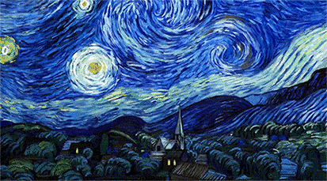
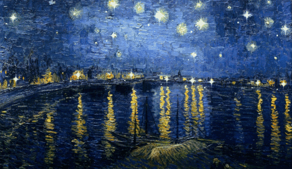
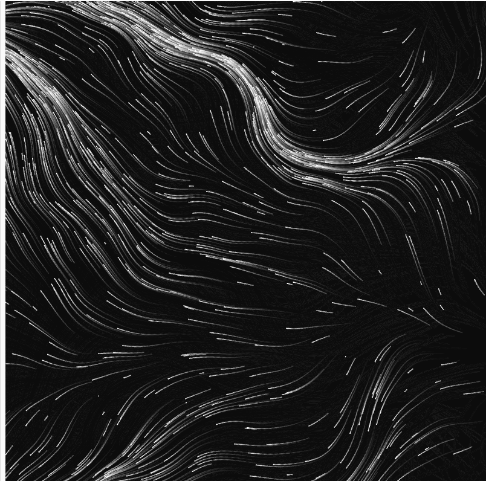

# Ywan0291_individual_tut1_groupB_9103
## Instructions about interaction with the work

Load the screen directly to see the animation, which is a continuous animation that doesn't stop

## Details of my individual approach to animating the group code
### Which did I choose to drive my individual code

I chose Perlin noise to drive my individual code.

### Which properties of the image will be animated and how

I animated all four parts of the image, but the main animations are focused on the sky part and sea part. 
In our group, most of the group members animated all of four parts, and to differentiate from their work (colour changing and making image 3d), 
I created a slow-flowing animation for the sky part and a shimmering (also flowing to the left) effect for the sea part. 
Later, I realized that if only the sky and ocean were animated, the image would feel somewhat unbalanced.
So I added a random rotation animation to the main building part to make it shows more dynamic.

### References to inspiration

To better bring the image to life, I referred to the way the movie "Loving Vincent" presents famous paintings, especially in the depiction of the sky and water. 
This moive uses animation techniques to dynamically process the brushstrokes in the paintings, so that the lines and the color blocks in the painting seem to flow.
This not only reflects the artist's inner emotions but also enhances the depth and emotional impact of the painting. 
These dynamic brushstrokes are especially evident in the sky and water, where swirling, vortex-like lines create a dreamlike atmosphere for the audience.

  

### A short technical explanation

I made two small changes to the group code: removing the background color and adding reflection part into the sea part. 
Removing the background color because if I keep the white background, it would show white interspersed during the animation, which affects the visual quality of the animation. 
And adding the reflection part into the sea part made it simpler to use the same animations for both reflection and sea part.

I referenced this code in my individual code.
What this code does is to generate a moving angle from Perlin noise, and then use the functions cos() and sin() to calculate the velocity of the object in the x and y directions. 
The object is then moved randomly and smoothly by updating the coordinates this.x and this.y. 
I use this Perlin noise-based movement to simulate the flow of the sky and make the visual effect look more natural.



[Code Link](https://editor.p5js.org/BarneyCodes/sketches/2eES4fBEL)

> This is the code I referenced.
```
function draw() {
  background(0, 10);
  for(let i = 0; i < num; i ++) {
    let p = particles[i];
    point(p.x, p.y);
    let n = noise(p.x * noiseScale, p.y * noiseScale, frameCount * noiseScale * noiseScale);
    let a = TAU * n;
    p.x += cos(a);
    p.y += sin(a);
    if(!onScreen(p)) {
      p.x = random(width);
      p.y = random(height);
    }
  }
}
```
Because I wanted a more natural regeneration, I changed the code in the regeneration section to be based on time rather than on being in or out of the screen.


